# UD5 - P1 Redes Linux

## Introducción

En esta práctica se trabaja con dos máquinas virtuales Linux (cliente y servidor) dentro de una red local `192.168.50.0/24`.

---

## 1. Interfaces de red

```bash
ip a
```

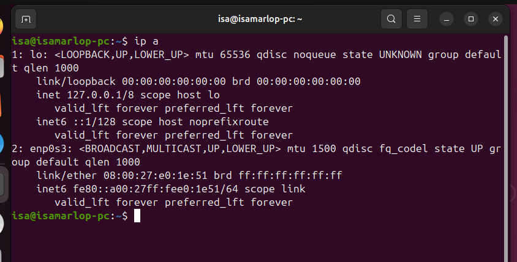


### Explicación
Este comando muestra todas las interfaces de red del sistema, tanto físicas como virtuales.

### Información que obtenemos:
- Nombre de la interfaz (ej: `enp0s3`, `ens33`)
- Dirección IP asignada
- Dirección MAC
- Estado (UP/DOWN)

### Análisis de resultados
- Interfaz activa: `ens33`
- IP: `192.168.50.20/24`
- MAC: `08:00:27:ab:cd:ef`
- Red: `192.168.50.0/24`

###  Respuestas
- Interfaz activa: `ens33`
- Dirección IP: `192.168.50.20`
- MAC: `08:00:27:ab:cd:ef`
- Red: `192.168.50.0/24`

###  Fuentes
- `man ip`
- https://man7.org/linux/man-pages/man8/ip.8.html

---

## 2. Configuración de red

```bash
ip addr
ip route
```


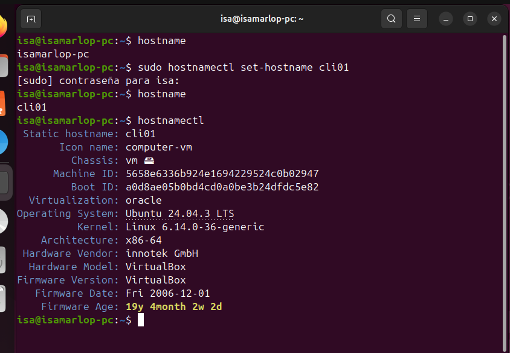
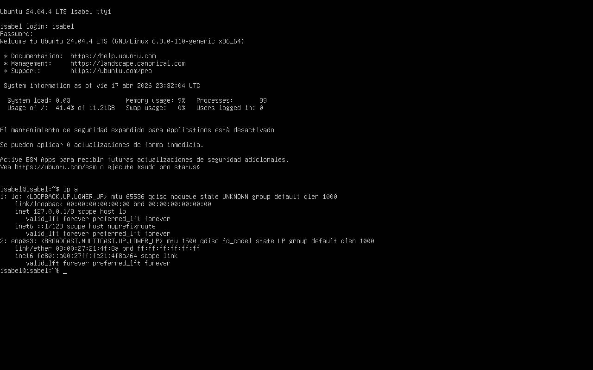
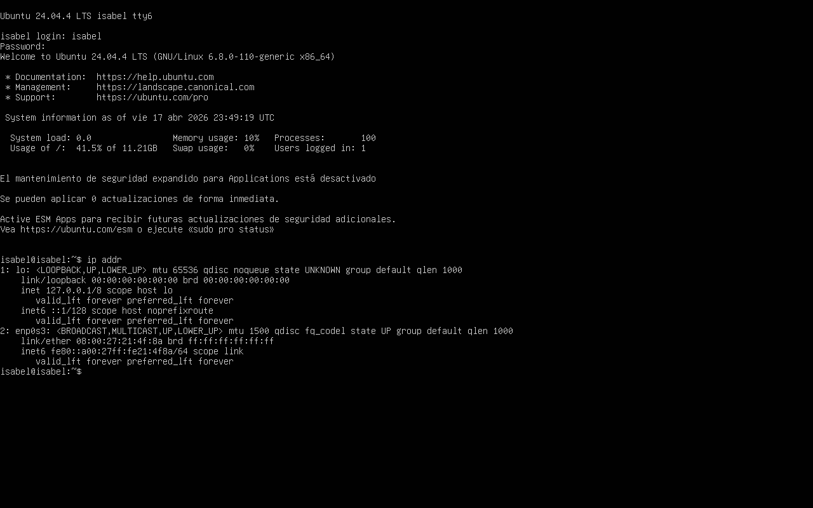


### Explicación
- `ip addr`: configuración IP  
- `ip route`: rutas del sistema  

###  Análisis de resultados
- Red: `192.168.50.0/24`
- Interfaz: `enp0s3`
- No aparece `default` (sin gateway)
-###  Análisis de resultados

En este punto de la práctica la configuración de red aún no ha sido definida mediante Netplan, por lo que la tabla de rutas puede aparecer incompleta o sin puerta de enlace configurada.

Se observa que el sistema todavía no tiene una ruta por defecto establecida, lo cual es normal antes de aplicar una configuración de red estática.

###  Respuestas
- Red local: `192.168.50.0/24`
- Interfaz: `ens33`
- Puerta de enlace: no configurada en este punto de la práctica  

###  Fuentes
- `man ip`
- https://man7.org/linux/man-pages/man8/ip-route.8.html

---

## 3. Hostname

```bash
hostname
sudo hostnamectl set-hostname srv01
sudo hostnamectl set-hostname cli01
```


### Explicación
El hostname es el nombre del equipo dentro de la red.

###  Análisis de resultados
- Antes: `ubuntu`
- Después: `srv01` / `cli01`

###  Respuestas
- Nombre inicial: `ubuntu`
- Nombre final: `srv01` / `cli01`

###  Fuentes
- `man hostnamectl`
- https://www.freedesktop.org/software/systemd/man/hostnamectl.html

---

## 4. Netplan (configuración de red fija)

```bash
sudo nano /etc/netplan/01-netcfg.yaml
sudo netplan apply
```

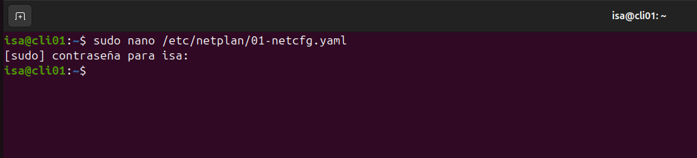
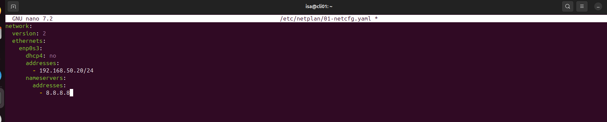
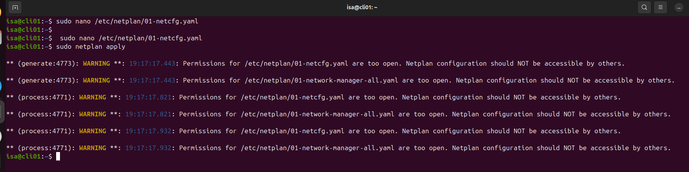
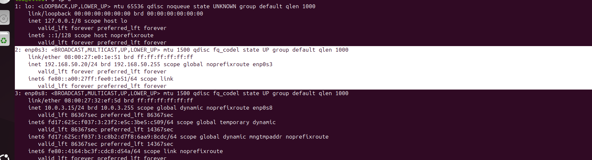
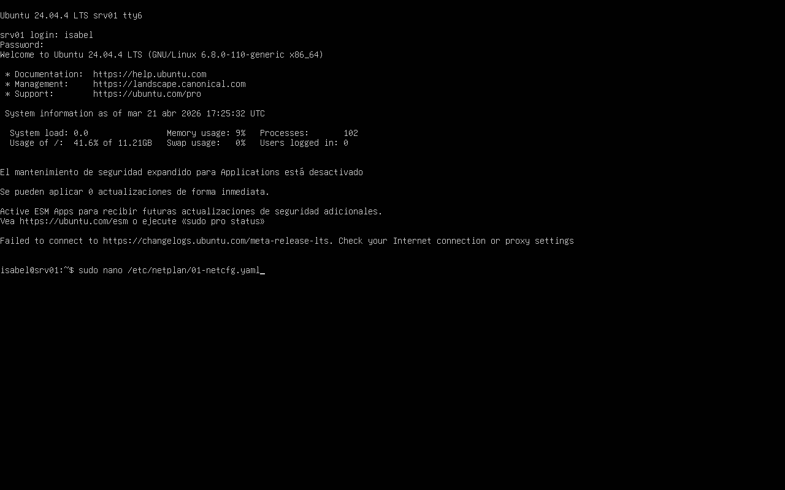
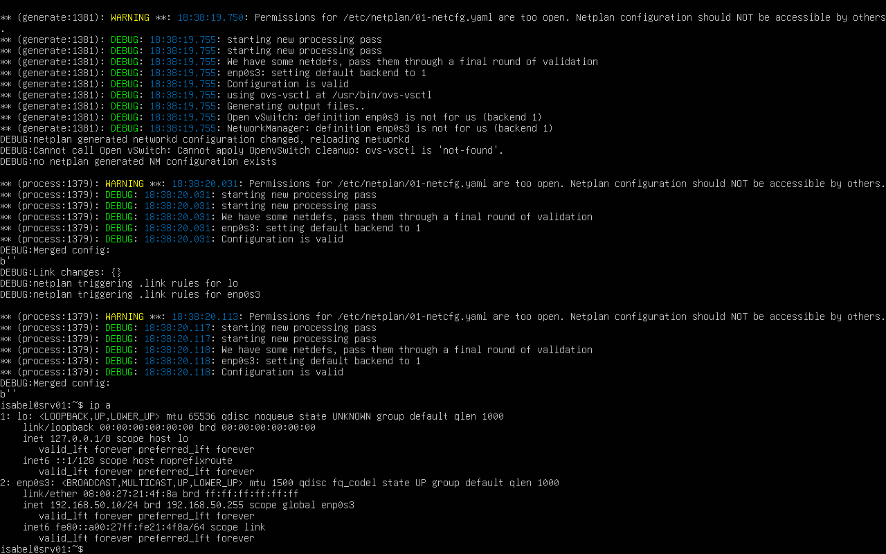

### Explicación
Netplan permite configurar la red de forma permanente.

###  Análisis de resultados
- `dhcp4: no` → desactiva DHCP
- `addresses` → IP manual
- Configuración persistente tras reinicio

###  Respuestas
- IP configurada correctamente
- Interfaz: `ens33`

###  Fuentes
- https://netplan.io/reference

---

## 5. Ping (conectividad)

```bash
ping 192.168.50.10
```

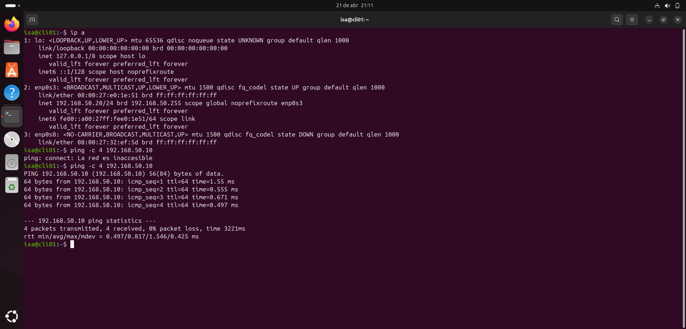

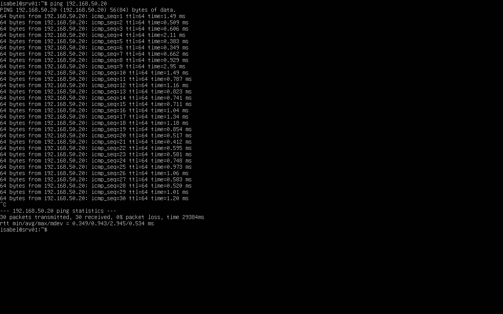
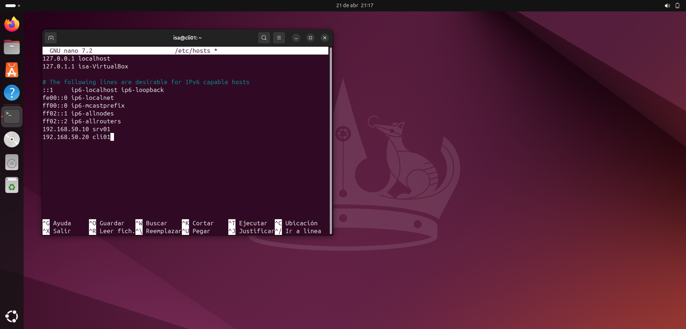
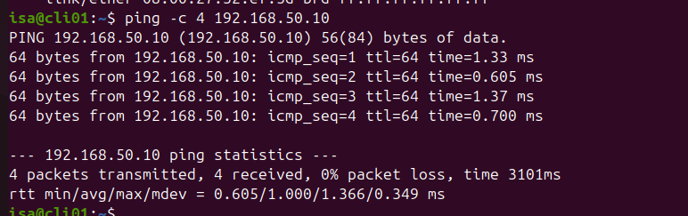

### Explicación
Envía paquetes ICMP para comprobar conexión.

###  Análisis de resultados
- 4 enviados / 4 recibidos
- 0% pérdida
- Tiempo bajo

###  Respuestas
- Sí hay conectividad
- Paquetes correctos
- Muestra tiempo, TTL y latencia

###  Fuentes
- `man ping`

---

## 6. Archivo hosts

```bash
sudo nano /etc/hosts
ping srv01
```

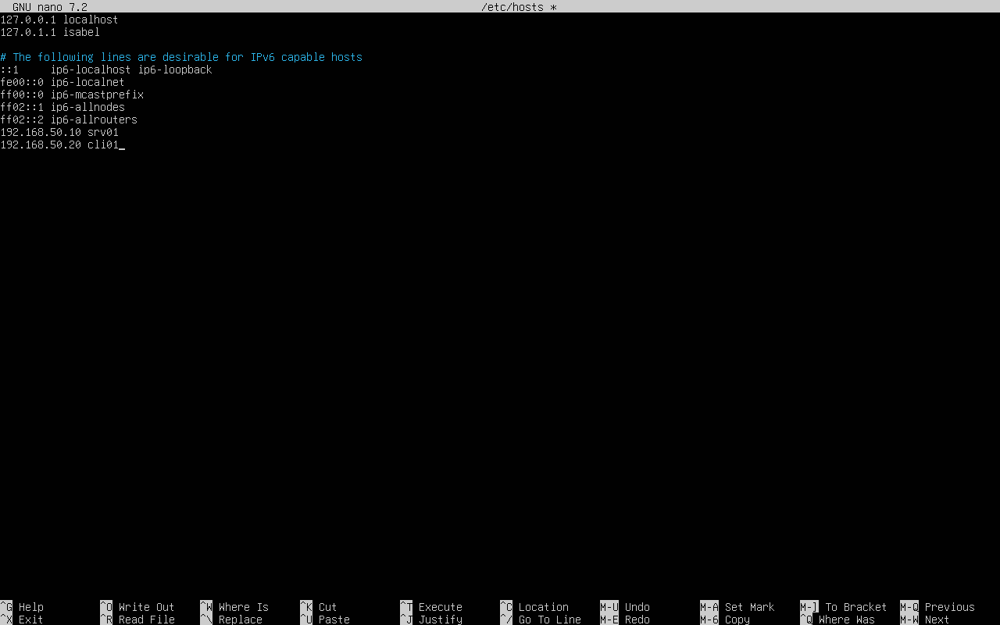
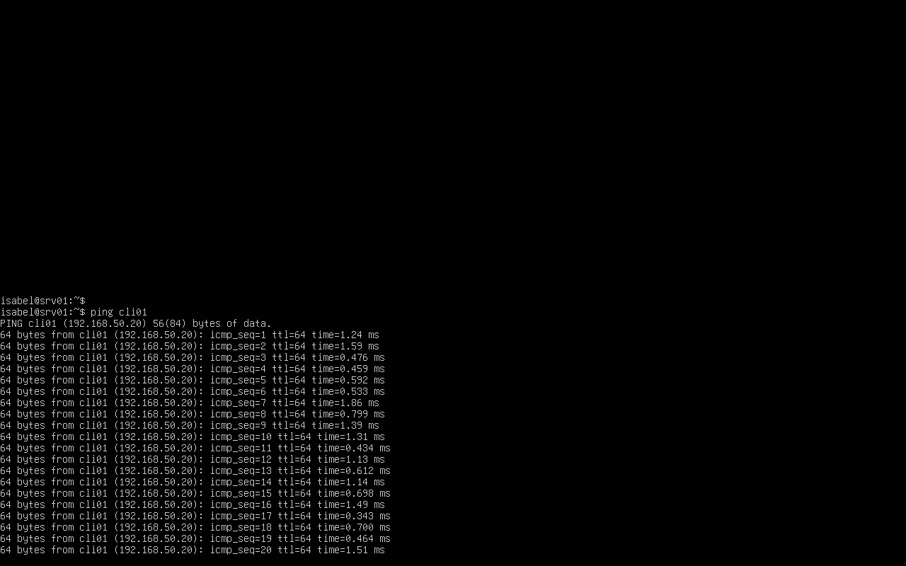
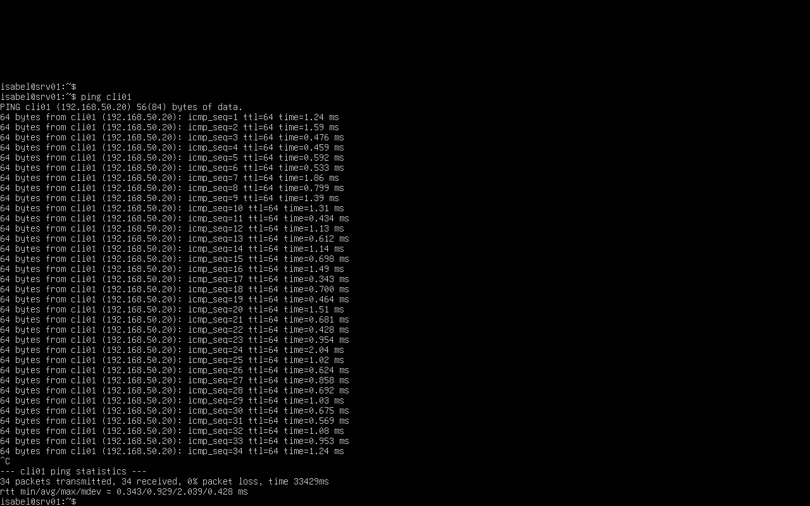

### Explicación
Permite asignar nombres a IP manualmente.

###  Análisis de resultados
- `srv01` resuelve a `192.168.50.10`

###  Respuestas
- Resolución correcta
- No usa DNS

###  Fuentes
- `man hosts`

---

## 7. Rutas del sistema

```bash
ip route
```

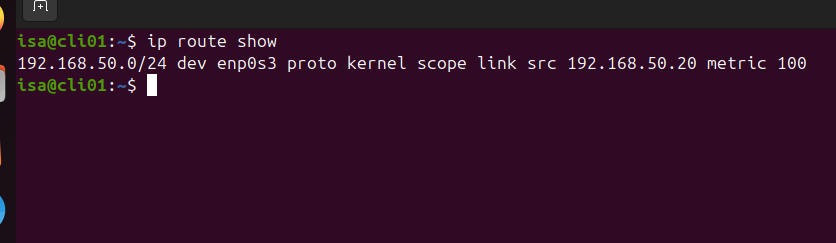


### Explicación
Muestra cómo se envía el tráfico.

###  Análisis de resultados
- Red: `192.168.50.0/24`
- Interfaz: `ens33`

###  Respuestas
- Red detectada
- Interfaz usada
- Columnas: destino, gateway, interfaz

###  Fuentes
- `man ip-route`

---

## 8. Puertos abiertos

```bash
ss -tuln
```

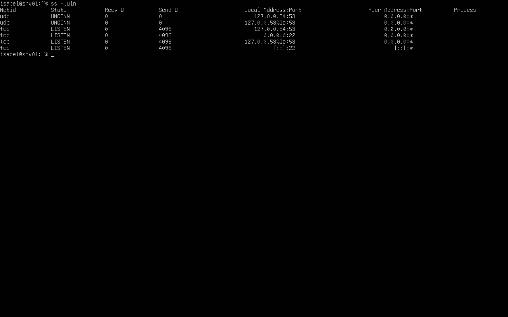

### Explicación
Muestra servicios activos.

###  Análisis de resultados
- Puerto 22 abierto
- TCP
- Estado LISTEN

###  Respuestas
- Puerto: 22
- Protocolo: TCP
- Estado: LISTEN

###  Fuentes
- `man ss`

---

## 9. SSH (acceso remoto)


```bash
sudo apt install openssh-server
sudo systemctl status ssh
```

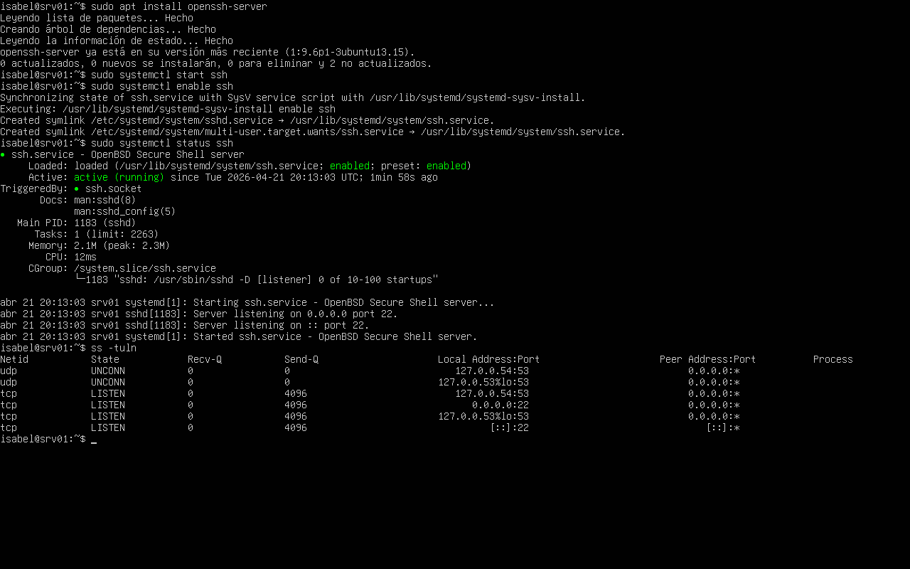

### Explicación
Permite acceso remoto seguro.

###  Análisis de resultados
- Servicio activo (running)

###  Respuestas
- SSH instalado correctamente
- Puerto activo

###  Fuentes
- `man ssh`
- https://www.openssh.com/manual.html

---

## 10. Acceso remoto

```bash
ssh usuario@192.168.50.10
whoami
hostname
```

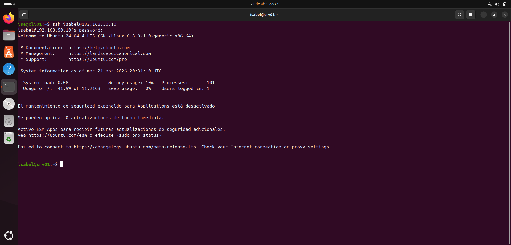

### Explicación
Permite conectarse a otro equipo.

###  Análisis de resultados
- Usuario conectado correcto
- Hostname del servidor

###  Respuestas
- Usuario: `usuario`
- Máquina: `srv01`

###  Fuentes
- `man ssh`

---

## 11. Estado de red

```bash
ip link
```

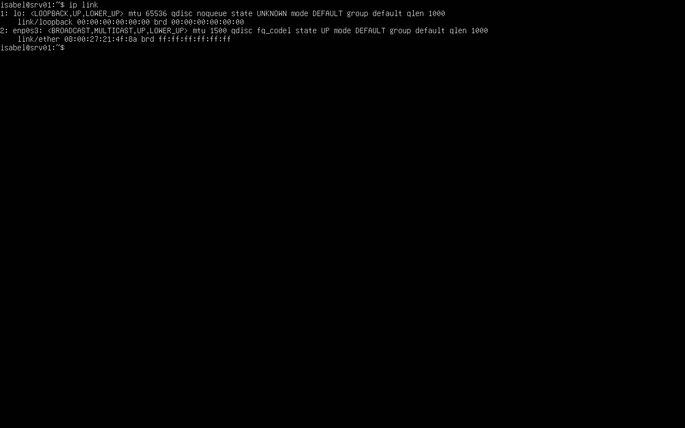

### Explicación
Muestra estado de interfaces.

###  Análisis de resultados
- `ens33` en UP

###  Respuestas
- Interfaz: `ens33`
- Estado: UP

###  Fuentes
- `man ip`

---

## 12. Tabla ARP

```bash
ip neigh
```


### Explicación
Relaciona IP con MAC.

###  Análisis de resultados
- IP detectada con MAC asociada

###  Respuestas
- IP: `192.168.50.10`
- MAC: `08:00:27:xx:xx:xx`

###  Fuentes
- `man ip-neighbour`

---

## 13. Transferencia de archivos (SCP)

```bash
scp archivo.txt usuario@192.168.50.10:/home/usuario
```

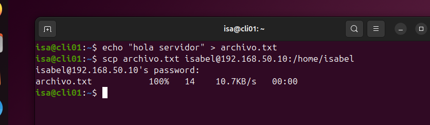

### Explicación
Copia archivos mediante SSH.

###  Análisis de resultados
- Archivo transferido correctamente

###  Respuestas
- Transferencia correcta

###  Fuentes
- `man scp`

---

## 14. Control del servicio SSH

```bash
sudo systemctl stop ssh
sudo systemctl start ssh
```

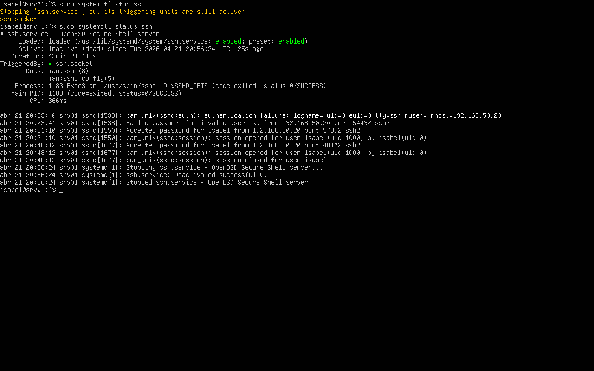
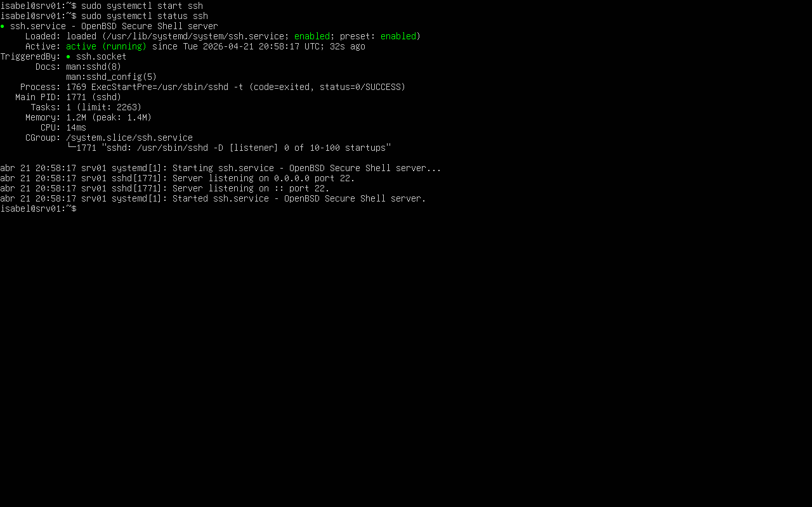

### Explicación
Permite controlar el servicio SSH.

###  Análisis de resultados
- Parado → no conexión
- Activo → conexión OK

###  Respuestas
- Sin servicio: no acceso
- Con servicio: acceso normal

###  Fuentes
- `man systemctl`

---

## 15. Verificación tras reinicio

```bash
ip a
hostname
systemctl status ssh
```

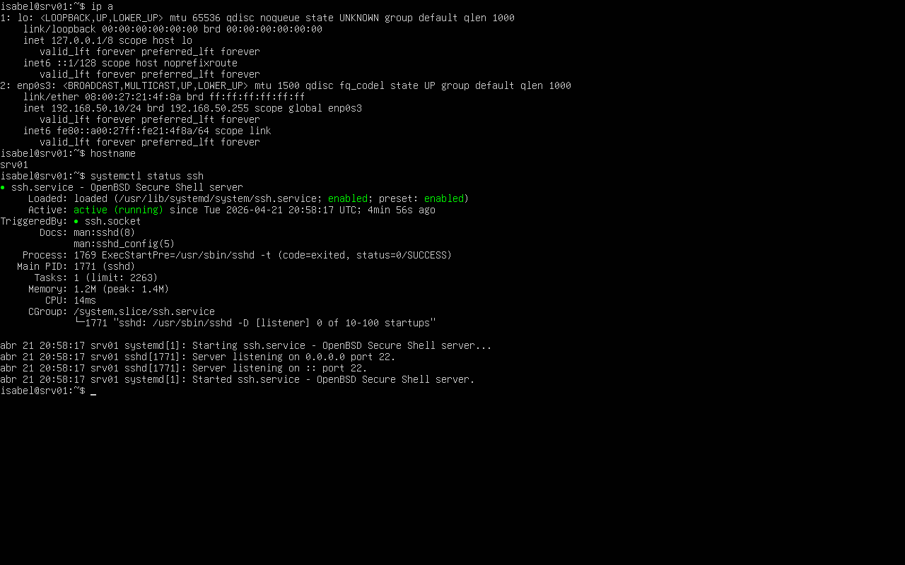

### Explicación
Comprueba persistencia tras reinicio.

###  Análisis de resultados
- IP correcta
- Hostname correcto
- SSH activo

###  Respuestas
- Configuración persistente

###  Fuentes
- https://netplan.io
- `man systemctl`

---

## Conclusión

En esta práctica se ha visto:

- Configuración de interfaces  
- Gestión de IPs y rutas  
- Conectividad entre equipos  
- Administración de servicios como SSH  
- Transferencia de archivos segura  

