# UD5 - P3 Active Directory

## Introducción

Active Directory es un servicio de directorio que permite la gestión centralizada de usuarios, equipos y recursos dentro de una red Windows.

En esta práctica se configura un dominio Windows en el que un servidor actuará como controlador de dominio y un equipo cliente Windows 11 se unirá al dominio. Esto permite la autenticación centralizada, la aplicación de políticas de seguridad y la gestión unificada de los recursos de red.

---

## 1. Configuración del servidor

Comando utilizado:

    hostname

### Explicación
Se cambia el nombre del servidor a `srv-ad01` para identificarlo correctamente dentro de la red.

Este servidor tendrá el rol de controlador de dominio, encargándose de la autenticación de usuarios, la gestión de recursos y la aplicación de políticas de seguridad en toda la red.

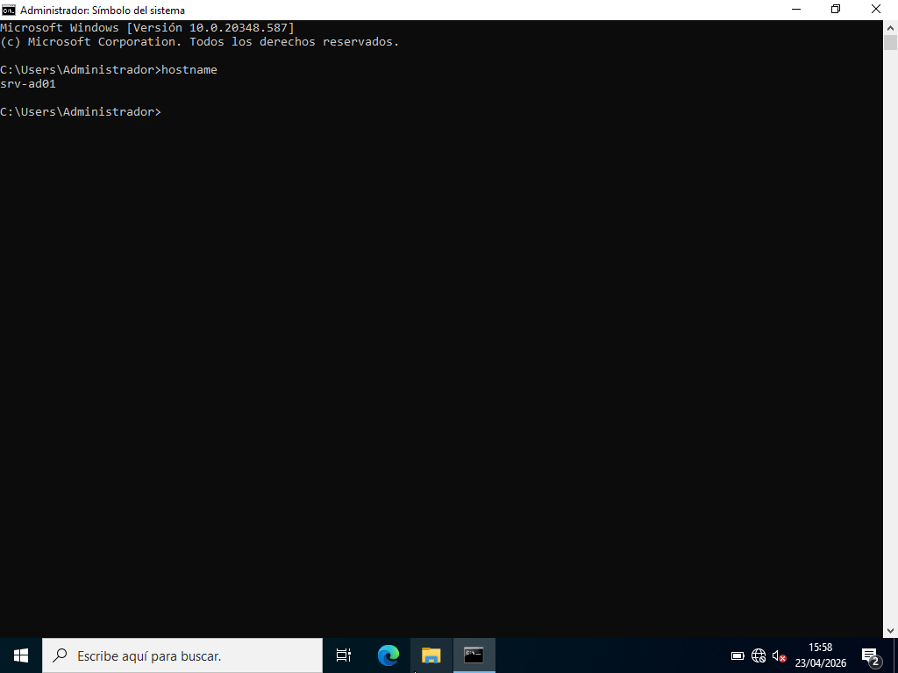

### Objetivo
Preparar el servidor para su función como controlador de dominio.

---

## 2. Instalación de AD DS

### Explicación
Se instala el rol :contentReference[oaicite:1]{index=1} desde Server Manager mediante el asistente “Add Roles and Features”.

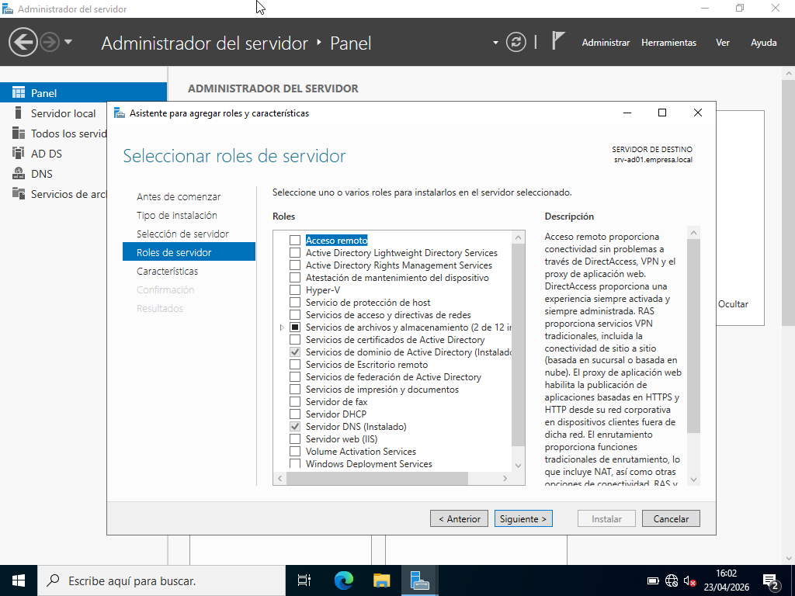

Este servicio permite:
- Crear y administrar dominios Windows
- Gestionar usuarios y equipos
- Centralizar la administración de la red

### Objetivo
Instalar el servicio necesario para implementar el dominio.

---

## 3. Creación del dominio

Nombre del dominio:

    empresa.local

### Explicación
Se promueve el servidor como controlador de dominio mediante la opción “Promote this server to a domain controller” y se selecciona “Add a new forest”.

Durante este proceso se configura el dominio `empresa.local` y se establece una contraseña para el modo de restauración (DSRM).

Convertir el servidor en controlador de dominio implica que este almacenará la base de datos del directorio (NTDS.dit), donde se guardan los objetos del dominio como usuarios, grupos y equipos. Además, se encargará de la autenticación mediante protocolos como Kerberos.

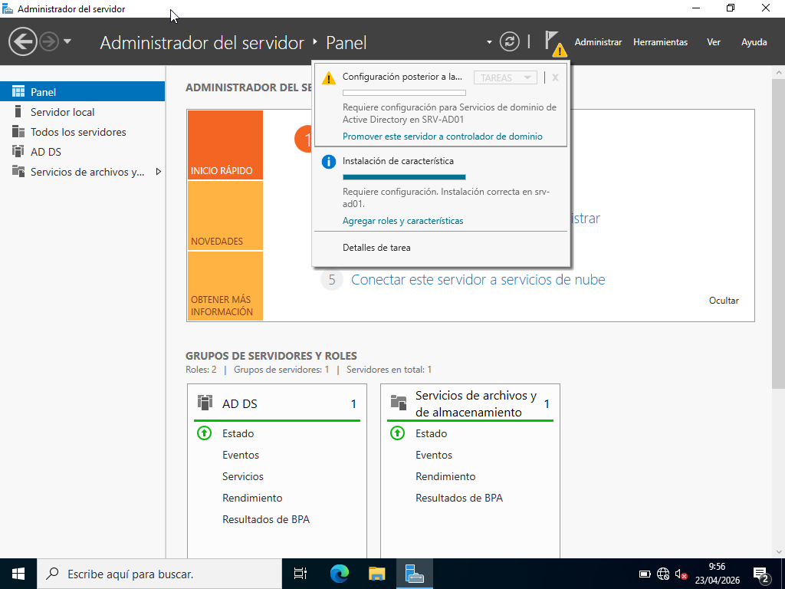

### Objetivo
Convertir el servidor en el centro de gestión del dominio.

---

## 4. Verificación del dominio

### Explicación
Se accede a la herramienta Active Directory Users and Computers para comprobar que el dominio se ha creado correctamente.

En la captura se observa la estructura del dominio, con contenedores como:
- Users
- Computers
- Domain Controllers

Estos contenedores forman parte de la estructura lógica de Active Directory, donde los objetos se organizan jerárquicamente, permitiendo una administración eficiente y la aplicación de políticas.

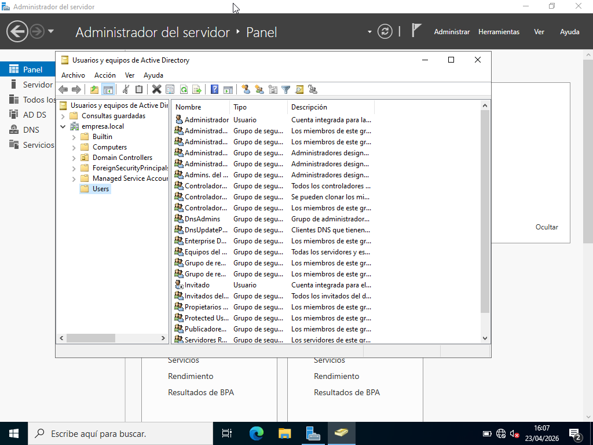

### Objetivo
Confirmar que el dominio está operativo.

---

## 5. Creación de usuarios

Usuarios creados:
- usuario1
- usuario2

### Explicación
Se crean usuarios desde Active Directory Users and Computers.

Un usuario de dominio puede iniciar sesión en cualquier equipo unido al dominio, mientras que un usuario local solo existe en un equipo específico y no permite administración centralizada.

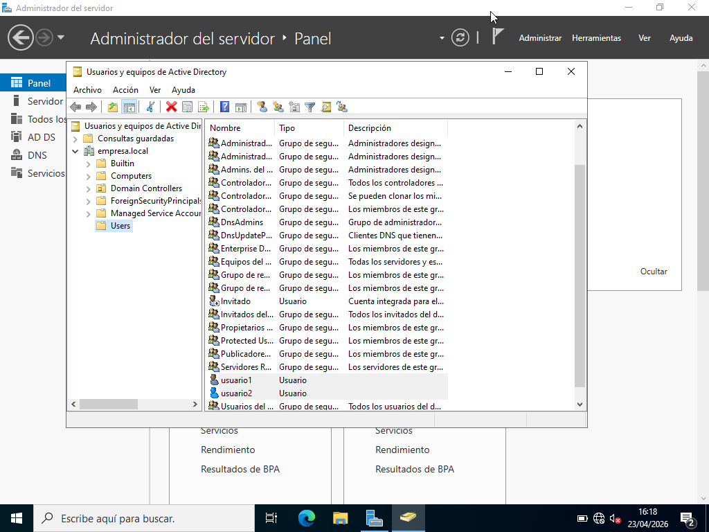

### Objetivo
Gestionar usuarios de forma centralizada en el dominio.

---

## 6. Carpeta de perfiles

Ruta:

    C:\perfiles

Recurso compartido:

    perfiles

### Explicación
Se crea una carpeta en el servidor y se comparte en red para almacenar los perfiles de usuario.

Para el correcto funcionamiento de los perfiles móviles, es necesario configurar los permisos adecuados, permitiendo que cada usuario tenga acceso exclusivo a su propia carpeta.

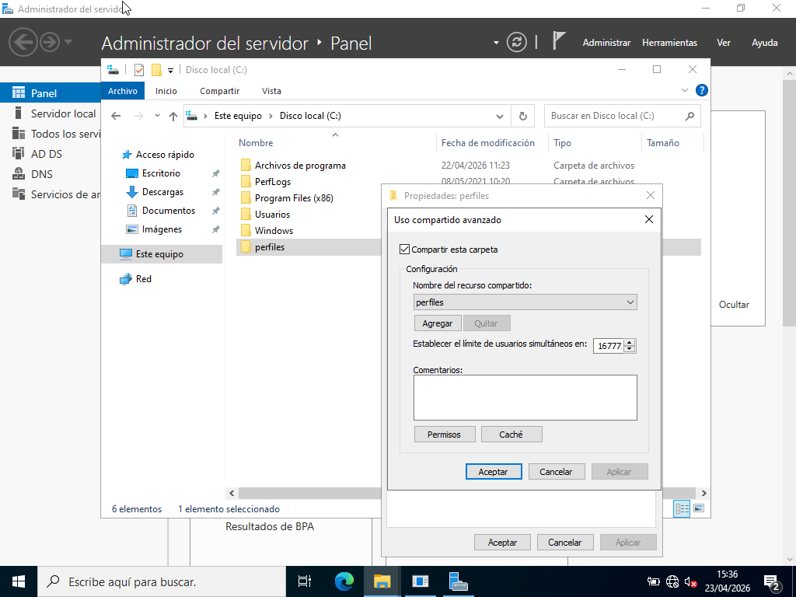

### Objetivo
Centralizar el almacenamiento de perfiles de usuario.

---

## 7. Perfiles móviles

Ruta del perfil:

    \\srv-ad01\perfiles\%username%

### Explicación
Se configura la ruta del perfil en las propiedades de cada usuario, dentro de la pestaña Profile.

Un perfil móvil permite que la configuración del usuario (escritorio, archivos, preferencias) se almacene en el servidor y se cargue en cualquier equipo del dominio.

Estos perfiles se sincronizan al iniciar y cerrar sesión, lo que permite mantener el entorno del usuario, aunque puede aumentar el tráfico de red y el tiempo de carga.

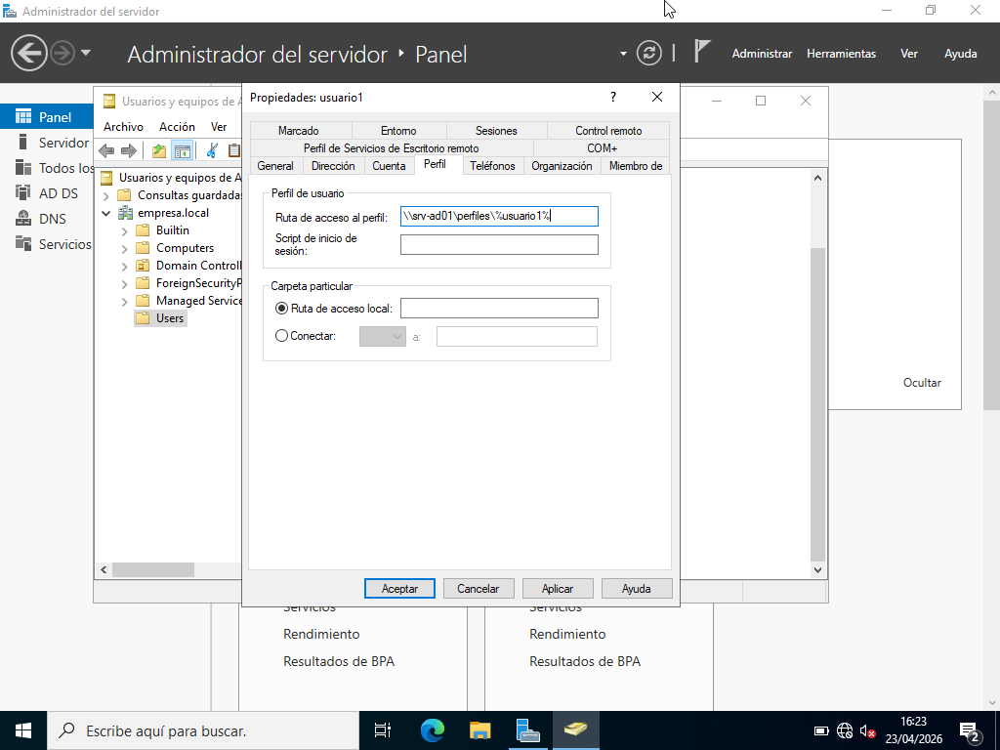

### Objetivo
Permitir la movilidad del usuario dentro del dominio.

---

## 8. Unión al dominio

Dominio:

    empresa.local

### Explicación
El equipo cliente `cli01` se une al dominio introduciendo las credenciales del administrador.

En la captura se muestra el proceso de unión al dominio.

Durante este proceso, el equipo se registra en Active Directory como un objeto del dominio, lo que permite su gestión centralizada y la aplicación de políticas.

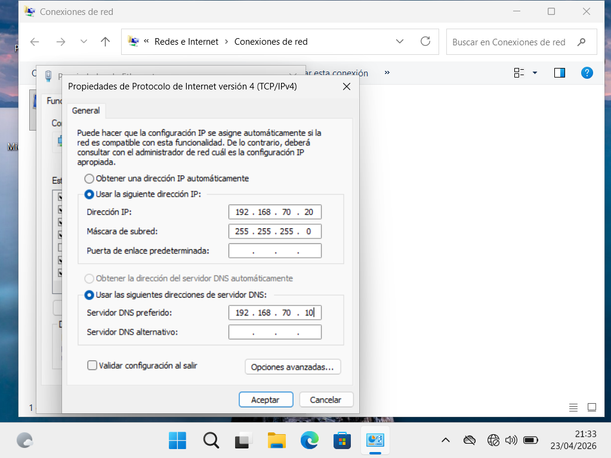
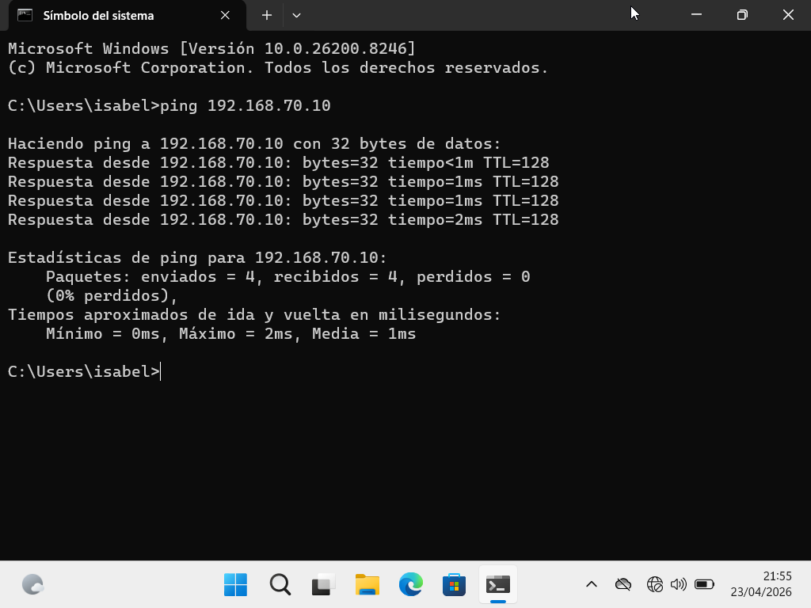
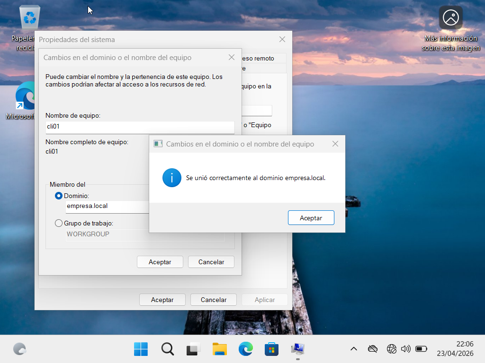

### Objetivo
Integrar el equipo cliente dentro del dominio.

---

## 9. Inicio de sesión

Usuarios:
- empresa\usuario1
- empresa\usuario2

### Explicación
Se inicia sesión en el cliente utilizando cuentas del dominio.

En la captura se observa el inicio de sesión y la creación automática de carpetas de perfil en el servidor.

Esto confirma que los perfiles móviles están funcionando correctamente, ya que los datos del usuario se almacenan de forma centralizada.

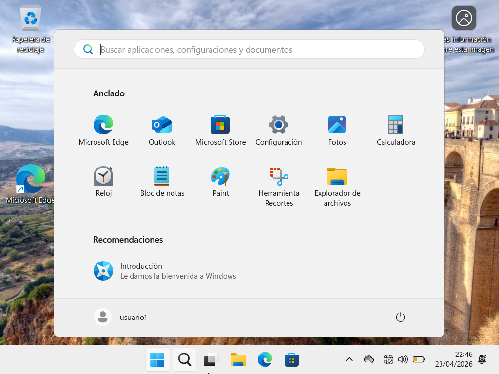

### Objetivo
Verificar la autenticación y el funcionamiento de los perfiles móviles.

---

## 10. GPO (Group Policy)

### Explicación
Se utilizan las políticas de grupo mediante la herramienta :contentReference[oaicite:2]{index=2}.

En la captura se muestra la edición de la política “Default Domain Policy”, donde se modifican parámetros como:
- Longitud mínima de contraseña
- Complejidad de contraseña

Las Group Policy Objects (GPO) son configuraciones centralizadas que se aplican a usuarios y equipos del dominio, permitiendo estandarizar la seguridad y el comportamiento del sistema.

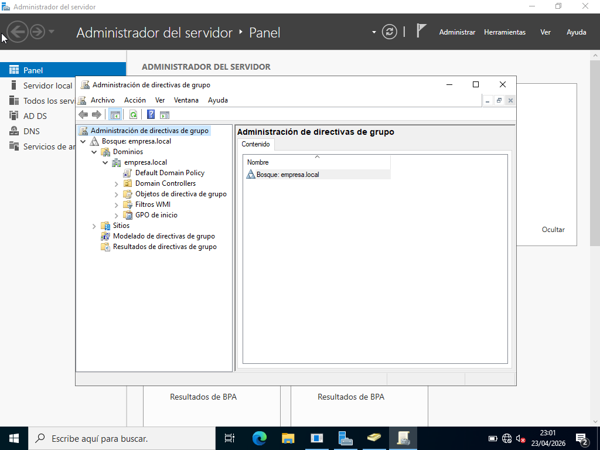

### Objetivo
Controlar la configuración de seguridad del dominio.

---

## 11. Aplicación de políticas

Comando:

    gpupdate /force

### Explicación
Se ejecuta este comando en el equipo cliente para forzar la actualización de las políticas.

En la captura se muestra su ejecución en la consola.

Las políticas se aplican automáticamente al iniciar sesión, pero este comando permite aplicarlas de forma inmediata desde el controlador de dominio.

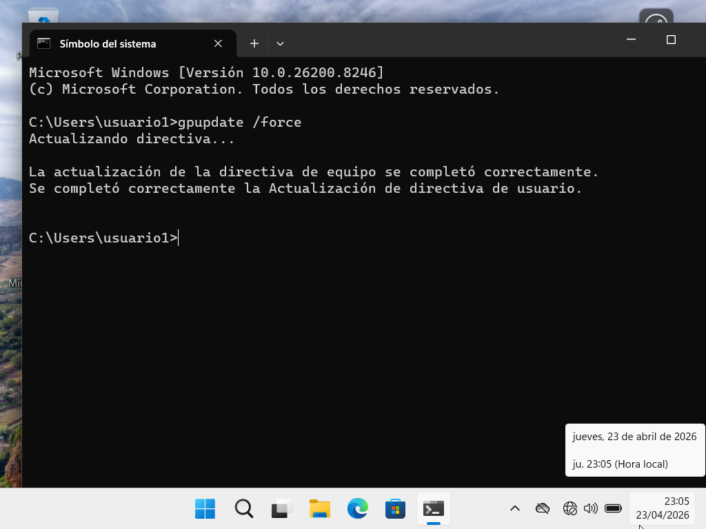

### Objetivo
Aplicar las políticas configuradas en el dominio.

---

## 12. Comprobación final

### Resultado

Se verifica que:
- El equipo cliente pertenece al dominio
- Los usuarios pueden iniciar sesión correctamente
- Los perfiles móviles se almacenan en el servidor
- Las políticas de contraseña se aplican correctamente

### Explicación
El dominio implementado permite la gestión centralizada de usuarios, equipos y configuraciones, asegurando un entorno más seguro y eficiente.

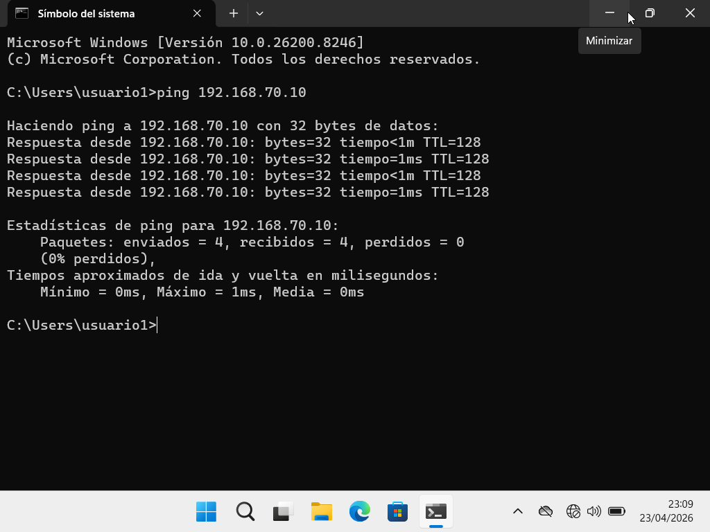
---

## Conclusión

La implementación de un dominio mediante Active Directory permite centralizar la autenticación, la administración de recursos y la aplicación de políticas de seguridad.

Esto mejora la seguridad, la escalabilidad y la eficiencia en entornos empresariales, facilitando la gestión de múltiples usuarios y equipos desde un único punto de control.

---

## Fuentes consultadas

- :contentReference[oaicite:3]{index=3} Learn:
  - https://learn.microsoft.com/windows-server/identity/ad-ds/active-directory-domain-services-overview  
  - https://learn.microsoft.com/windows-server/identity/ad-ds/manage/group-policy/group-policy-overview  

- Documentación oficial de Windows Server

- Tutoriales técnicos de implementación de Active Directory